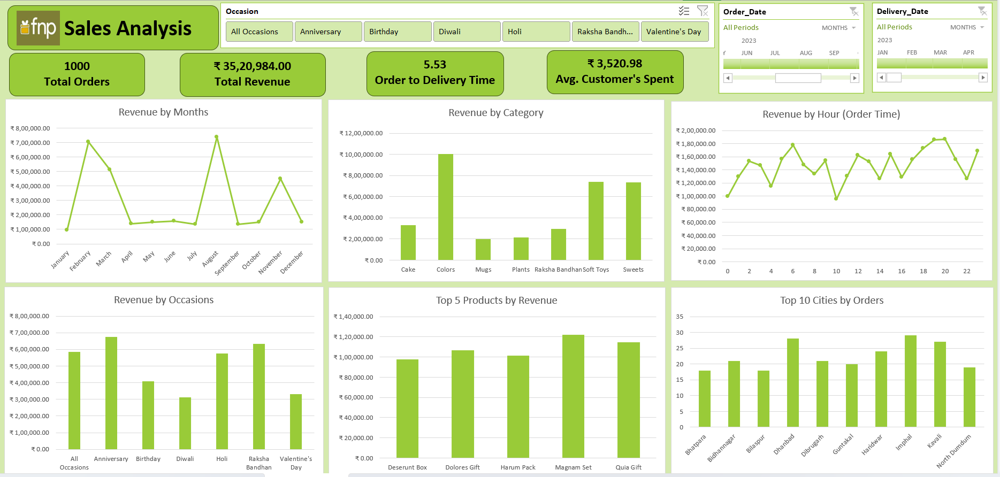

# FNP Sales Analysis Dashboard

## Project Overview

Developed an interactive Sales Analysis Dashboard in Microsoft Excel to analyze 1,000 customer orders and ₹35.2L+ in revenue. The dashboard enables users to track key business metrics, identify sales trends, evaluate product performance, monitor delivery efficiency, and analyze customer purchasing behavior through interactive filters and visualizations.

## Dashboard Preview

## Key Metrics

* Total Orders: 1,000
* Total Revenue: ₹35,20,984
* Average Customer Spend: ₹3,520.98
* Average Order-to-Delivery Time: 5.53 Days

## Key Insights

* Revenue peaks during February and August, indicating strong seasonal demand.
* Colors, Soft Toys, and Sweets generated the highest revenue among categories.
* Anniversary and Raksha Bandhan contributed significantly to overall sales.
* Magnam Set and Quia Gift were among the top-performing products.
* Imphal, Dhanbad, and Kavali recorded the highest order volumes.

## Tools & Techniques Used

- Microsoft Excel
- Power Query (Data Cleaning & Transformation)
- Power Pivot
- Excel Data Model
- Data Relationships
- DAX Measures
- Pivot Tables
- Pivot Charts
- Slicers
- Timeline Slicers
- Interactive Dashboard Design

## Skills Demonstrated

- Data Cleaning & Transformation
- Data Modeling
- DAX Measure Creation
- KPI Development
- Sales Data Analysis
- Business Intelligence Reporting
- Dashboard Development
- Data Visualization

## Author

Raj Varma

LinkedIn: [www.linkedin.com/in/raj-varma9326](http://www.linkedin.com/in/raj-varma9326)
